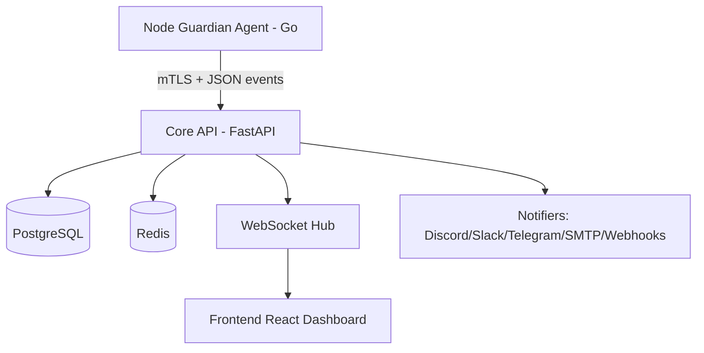
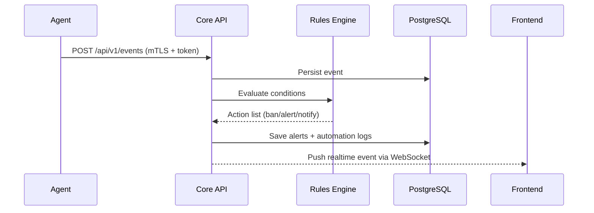

# Arquitetura SynexGuard

## Visão de Componentes

## Fluxo de Eventos

## Princípios

- Modularização por domínios (`servers`, `security`, `alerts`, `automation`)
- Segurança por padrão (JWT, RBAC, rate-limit, audit trail)
- Escala horizontal stateless no backend
- Comunicação assíncrona orientada a eventos
- Observabilidade com métricas e logs estruturados
